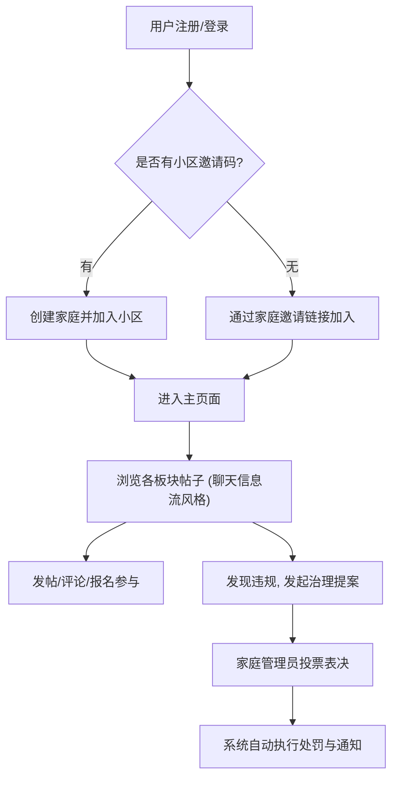

## 1. 产品概述
邻居，你好！(Neighbor, Hello!) 是一款以小区为范围的邻里协作与去中心化自治社区应用。
- 目标：以“家庭”为信任与治理单位，提供邻里互助板块与无平台管理员裁决的自治治理。
- 核心价值：促进邻里互助（如约饭、带娃等），实现真正的社区自治（提案投票、违规处罚），口号为“远亲不如近邻！”。

## 2. 核心功能

### 2.1 用户角色
| 角色 | 注册方式 | 核心权限 |
|------|----------|----------|
| 普通用户 | 账号密码注册/登录（可选绑定手机），加入已有家庭 | 发帖、评论、参与活动 |
| 家庭管理员 | 使用小区邀请码+图形验证码创建家庭 | 拥有普通用户所有权限，外加发起治理提案、参与投票权 |

### 2.2 功能模块
1. **认证与家庭管理**: 注册登录、创建/加入家庭、角色选择、管理员转让
2. **邻里社交 (仿聊天界面风格)**: 系统板块列表（约饭/带娃/遛狗/拼车/运动）、帖子信息流与详情、报名与评论、邻里好友管理
3. **自治治理**: 提案发起（隐藏/解禁等）、投票面板、通知中心（透明公示）

### 2.3 页面详情
| 页面名称 | 模块名称 | 功能描述 |
|----------|----------|----------|
| **认证页** | 登录/注册表单 | 用户认证，包含图形验证码，可选手机号 |
| **主页(主视窗)** | 侧边导航栏 | 用户信息、快速发帖悬浮按钮、系统板块列表/好友列表切换、底部功能Tab栏（个人/板块/治理） |
| | 主内容区(信息流) | 当前选中板块的帖子列表，类似聊天记录的信息流展示。支持文字、评论展示。 |
| | 详情与互动区 | 帖子的详细互动（评论、报名），支持发送消息式评论。 |
| **治理面板** | 提案列表 | 当前进行中和已结束的治理提案列表，显示倒计时、投票进度、阈值要求。 |
| | 投票操作区 | 家庭管理员进行同意/反对/弃权投票的操作界面。 |
| **个人与设置** | 主题切换 | 提供四种预设主题色（紫色、绿色、蓝色、橙色）的快速切换，实时改变全站配色。 |
| | 通知中心 | 接收系统公告、治理结果透明通知、好友请求等。 |

## 3. 核心流程
用户通过邀请码注册并创建家庭，进入主页后，可在左侧边栏切换不同的邻里板块。主内容区以类似现代聊天软件的信息流形式展示帖子与活动。用户可浏览、评论、报名参与。如果发现违规内容，家庭管理员可发起隐藏提案，其他管理员在治理面板中参与投票。系统根据规则自动计算结果并执行隐藏或禁言操作，同时发送透明通知。

## 4. 用户界面设计
### 4.1 设计风格
- **整体风格**: 现代、干净的聊天应用风格界面，左暗右明对比强烈，模块化卡片设计，运用圆角与阴影产生层级感。
- **主次色调**: 深色左侧边栏（如深紫灰/深灰），亮色右侧主内容区（白色/浅灰背景）。主色调为可定制的强调色，用于选中状态、主按钮、用户自己发送的内容气泡等。
- **主题配色方案**: 支持全局一键切换四种强调色：
  - **紫色 (Purple)**: 神秘、优雅（参考示例图）
  - **绿色 (Green)**: 清新、自然
  - **蓝色 (Blue)**: 科技、信任
  - **橙色 (Orange)**: 活力、温暖
- **组件样式**: 圆角（8px - 16px），悬浮元素带柔和阴影，输入框与搜索框呈胶囊或大圆角矩形。
- **字体**: 无衬线字体，如 Inter, Roboto 或系统默认现代中文字体，保证高可读性。标题加粗，辅助信息文字变浅。
- **动效**: 平滑的悬浮过渡（Hover states），页面切换与弹出层的轻量级渐显与位移动画。

### 4.2 页面设计概览
| 页面名称 | 模块名称 | UI 元素 |
|----------|----------|---------|
| **主控台** | 侧边栏 (Sidebar) | 深色背景，顶部包含大号 FAB 悬浮发帖按钮，用户信息；中部为带有在线状态红点/绿点、未读消息红底白字徽标的列表项；底部为高亮当前态的导航图标。 |
| | 主视窗 (Main View) | 浅色背景，顶部Header显示当前板块或提案名称；主体内容区采用对话气泡形式（他人发帖在左白底黑字，自己发帖在右主题色底白字）；底部为胶囊形输入框（带附件、表情图标）。 |

### 4.3 响应式设计
- 桌面端优先：完整展示侧边栏与主视窗并排的布局。
- 移动端适配：屏幕变窄时侧边栏隐藏，通过汉堡菜单呼出；主视窗占满全屏，适配触摸操作（更大的点击区域，手势滑动返回等）。
