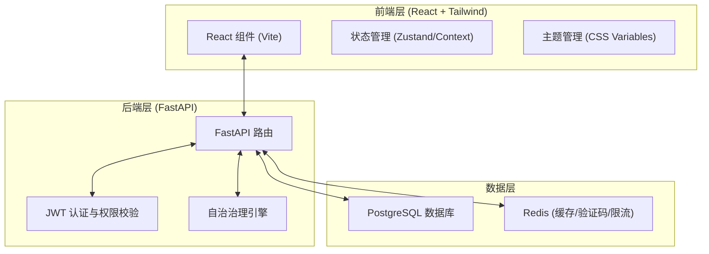
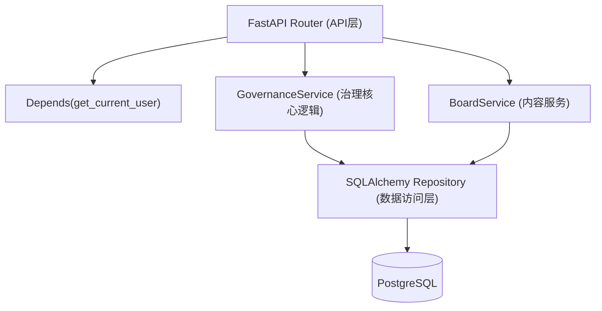
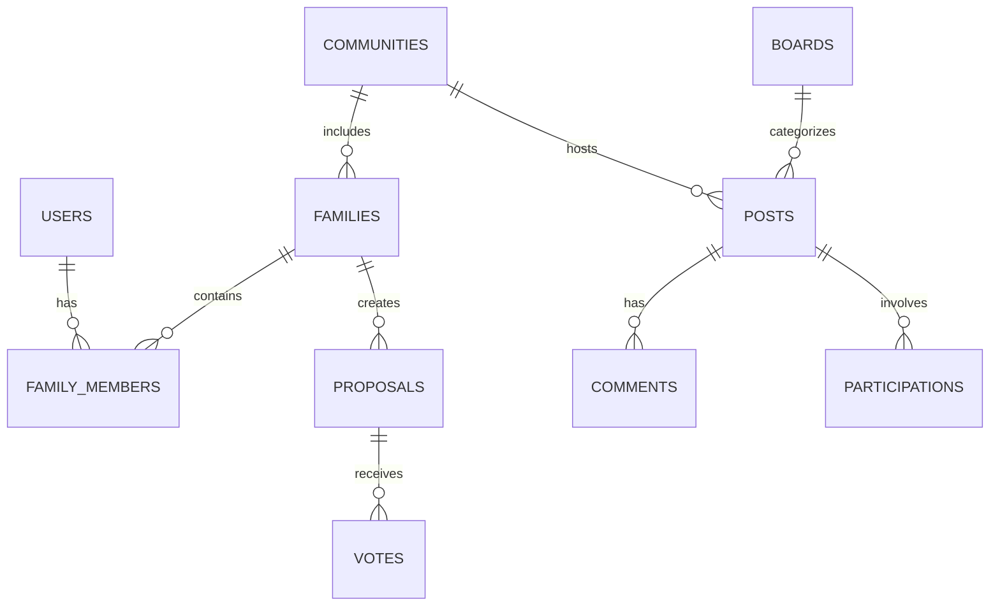

## 1. 架构设计


## 2. 技术说明
- **前端**: React 18 + Tailwind CSS 3 + Vite + React Router DOM + Lucide React (图标) + Zustand (状态与主题管理)
- **后端**: FastAPI + Uvicorn + SQLAlchemy 2.x (异步) + Alembic + Pydantic
- **数据库**: PostgreSQL 15+ 
- **缓存与辅助**: Redis (图形验证码存储、IP限流、可能的消息队列)
- **主题实现方案**: 前端通过注入不同的 CSS 变量类名到根节点（如 `.theme-purple`, `.theme-green`），配合 Tailwind 的自定义颜色配置，实现四种主题配色的动态切换。

## 3. 路由定义 (前端)
| 路由 | 作用 |
|------|------|
| `/` | 引导页或直接跳转到认证/主页 |
| `/login` | 用户登录与注册页面 |
| `/onboarding` | 邀请码校验与创建家庭/加入家庭流程 |
| `/app` | 核心应用主框架布局页面 |
| `/app/boards/:boardId` | 具体邻里板块详情流（约饭、拼车等） |
| `/app/governance` | 社区治理提案列表与投票大厅 |
| `/app/notifications` | 通知中心与公告 |
| `/app/settings` | 个人设置与主题配色切换 |

## 4. API 定义 (后端核心)
- `POST /api/v1/auth/register` - 注册
- `POST /api/v1/auth/login` - 登录
- `POST /api/v1/captcha/new` - 获取图形验证码
- `POST /api/v1/families` - 创建家庭并加入小区
- `GET /api/v1/boards` - 获取系统板块
- `GET /api/v1/posts` - 获取板块帖子
- `POST /api/v1/posts` - 发帖
- `POST /api/v1/proposals` - 发起治理提案
- `POST /api/v1/proposals/:id/vote` - 投票

## 5. 服务端架构图


## 6. 数据模型
### 6.1 数据模型定义


### 6.2 数据定义语言 (DDL 示例片段)
```sql
CREATE TABLE users (
    id UUID PRIMARY KEY,
    username VARCHAR(50) UNIQUE NOT NULL,
    password_hash VARCHAR(255) NOT NULL,
    status VARCHAR(20) DEFAULT 'normal',
    mute_until TIMESTAMP,
    created_at TIMESTAMP DEFAULT CURRENT_TIMESTAMP
);

CREATE TABLE communities (
    id UUID PRIMARY KEY,
    name VARCHAR(100) NOT NULL,
    current_stage INT DEFAULT 20,
    created_at TIMESTAMP DEFAULT CURRENT_TIMESTAMP
);

CREATE TABLE families (
    id UUID PRIMARY KEY,
    community_id UUID REFERENCES communities(id),
    name VARCHAR(100) NOT NULL,
    admin_user_id UUID REFERENCES users(id),
    joined_at TIMESTAMP DEFAULT CURRENT_TIMESTAMP,
    governance_enabled_at TIMESTAMP
);

-- 其它表结构略，见后端具体实现
```